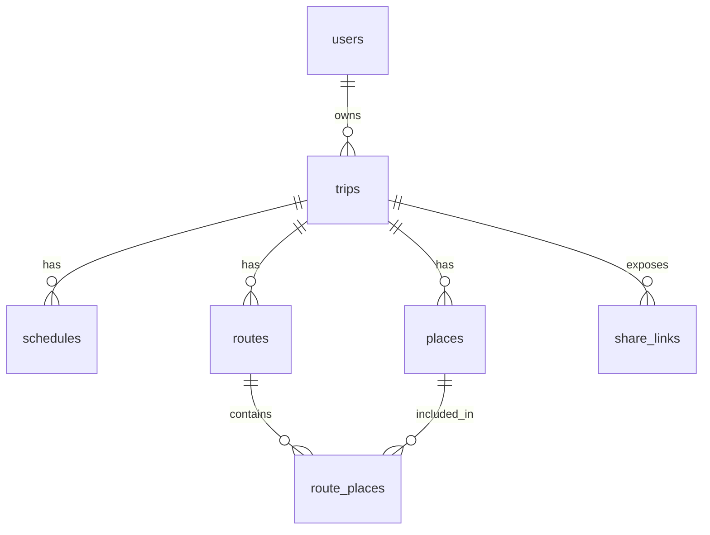

# 백엔드 포트폴리오 로드맵

이 문서는 가고시마 여행 앱을 신입/주니어 백엔드 포트폴리오로 설명할 수 있게 만들기 위한 구현 기준을 정리합니다.

핵심 목표는 단순히 "작동하는 앱"을 넘어서 아래 네 가지를 보여주는 것입니다.

1. REST API 설계와 구현
2. 관계형 데이터베이스 설계와 SQL 이해
3. 인증/인가와 에러 처리
4. 배포와 웹 요청 흐름 이해

## 1. REST API 개발 및 설계

사용자 입력형 Beta에서는 게시판 CRUD 대신 여행 도메인 CRUD를 구현합니다.

### 필수 API

| 기능 | Method | Path | 설명 |
| --- | --- | --- | --- |
| 회원가입 | POST | `/api/auth/register` | 이메일/비밀번호 가입 |
| 로그인 | POST | `/api/auth/login` | access token 발급 |
| 내 정보 | GET | `/api/me` | 현재 로그인 사용자 확인 |
| 여행 생성 | POST | `/api/trips` | 새 여행 생성 |
| 여행 목록 | GET | `/api/trips` | 내가 만든 여행 목록 |
| 여행 상세 | GET | `/api/trips/:tripId` | 여행 기본 정보 |
| 여행 수정 | PATCH | `/api/trips/:tripId` | 제목, 날짜, 메모 수정 |
| 일정 생성 | POST | `/api/trips/:tripId/schedules` | 일정 추가 |
| 일정 수정 | PATCH | `/api/schedules/:scheduleId` | 일정 수정 |
| 일정 삭제 | DELETE | `/api/schedules/:scheduleId` | 일정 삭제 |
| 장소 생성 | POST | `/api/trips/:tripId/places` | 숙소, 골프장, 맛집 추가 |
| 장소 수정 | PATCH | `/api/places/:placeId` | 장소 수정 |
| 장소 삭제 | DELETE | `/api/places/:placeId` | 장소 삭제 |
| 공유 링크 생성 | POST | `/api/trips/:tripId/share-links` | 읽기 전용 공유 링크 생성 |
| 공유 조회 | GET | `/api/share/:token/trip` | 로그인 없는 공유 여행 조회 |

### 설계 기준

- URL에는 동사보다 리소스 명사를 사용한다.
- 생성은 `POST`, 조회는 `GET`, 부분 수정은 `PATCH`, 삭제는 `DELETE`를 사용한다.
- 생성 성공은 `201 Created`, 삭제 성공 후 응답 본문이 없으면 `204 No Content`를 사용한다.
- 잘못된 입력은 `400 Bad Request`, 인증 실패는 `401 Unauthorized`, 권한 없음은 `403 Forbidden`, 없는 리소스는 `404 Not Found`로 구분한다.
- API 문서는 OpenAPI/Swagger 형식으로 정리한다.

## 2. 인증과 인가

이 프로젝트의 인증/인가는 부모님을 로그인시키기 위한 것이 아니라, 정보를 입력하는 여행 준비자를 보호하기 위한 것입니다.

### 인증

- 이메일/비밀번호 로그인
- 비밀번호는 bcrypt 해시로 저장
- 로그인 성공 시 JWT access token 발급
- `Authorization: Bearer <token>` 헤더로 보호 API 호출

### 인가

권한 규칙:

- 로그인한 사용자는 자신이 만든 여행만 수정할 수 있다.
- 다른 사용자의 여행, 일정, 장소는 수정할 수 없다.
- 공유 링크 사용자는 읽기 전용으로만 접근할 수 있다.
- 공유 링크 사용자는 관리자 API에 접근할 수 없다.

면접/포트폴리오에서 설명할 포인트:

- 인증은 "누구인지 확인"하는 과정이다.
- 인가는 "그 사용자가 이 리소스를 다룰 권한이 있는지 확인"하는 과정이다.
- JWT와 세션/쿠키 방식의 차이를 이해하고, 이 프로젝트에서 JWT를 선택한 이유를 설명한다.

## 3. 데이터베이스 설계

관계형 데이터베이스는 PostgreSQL을 우선합니다.

### 핵심 ERD



### 필수 테이블

- `users`
- `trips`
- `schedules`
- `places`
- `routes`
- `route_places`
- `share_links`

### SQL 학습 포인트

단순 CRUD만 하지 말고 아래 쿼리를 직접 작성하고 설명할 수 있어야 합니다.

- 특정 사용자의 여행 목록 조회
- 특정 여행의 일정 목록을 날짜와 정렬 순서로 조회
- 특정 여행의 장소 목록을 카테고리별로 조회
- 루트와 루트에 포함된 장소를 조인해서 조회
- 사용자의 여행 개수, 일정 개수 같은 통계 조회

### 인덱스 후보

| 테이블 | 인덱스 | 이유 |
| --- | --- | --- |
| `users` | `email` unique | 로그인 시 이메일 조회 |
| `trips` | `owner_id` | 내 여행 목록 조회 |
| `schedules` | `(trip_id, date, sort_order)` | 날짜별 일정 조회 |
| `places` | `(trip_id, category)` | 장소 카테고리 필터 |
| `share_links` | `token_hash` unique | 공유 링크 조회 |

## 4. 에러 처리와 검증

프론트에서 잘못된 요청이 들어와도 서버가 예측 가능한 응답을 내려야 합니다.

### 검증 예시

- 이메일 형식이 아니면 가입 실패
- 비밀번호가 너무 짧으면 가입 실패
- 여행 제목이 비어 있으면 생성 실패
- 종료일이 시작일보다 빠르면 생성 실패
- 일정 제목, 날짜, 시간 중 필수값이 없으면 생성 실패
- 존재하지 않는 `tripId`에 장소를 추가하면 실패

### 공통 에러 응답

```json
{
  "error": {
    "code": "VALIDATION_ERROR",
    "message": "입력값을 확인해 주세요.",
    "fields": {
      "title": "여행 제목은 필수입니다."
    }
  }
}
```

## 5. API 문서화

백엔드 포트폴리오에서는 API 문서가 중요합니다.

추천:
- OpenAPI 3.0 문서 작성
- Swagger UI 또는 Redoc 연결
- 요청/응답 예시 포함
- 인증이 필요한 API와 공개 API를 구분

문서화 우선순위:
1. 인증 API
2. 여행 CRUD API
3. 일정/장소 CRUD API
4. 공유 링크 API

## 6. 클라우드 배포

현재 프론트는 Vercel Hobby에 배포되어 있습니다. 백엔드 포트폴리오까지 고려하면 Go API와 PostgreSQL 배포 경험도 별도로 남기는 것이 좋습니다.

### 비용 우선 배포

1차:
- 프론트: Vercel
- 백엔드: 로컬 또는 무료/저비용 배포 후보
- DB: 로컬 PostgreSQL

2차 포트폴리오:
- Go API: Fly.io 또는 Render 무료/저비용 플랜 검토
- DB: Supabase Postgres 또는 Neon Postgres 무료 플랜 검토

AWS EC2/RDS 실습은 백엔드 이해에는 좋지만 비용 폭탄 위험이 있으므로, 별도 실습으로 짧게 진행하고 반드시 리소스를 삭제합니다.

## 7. 웹 요청 흐름 설명

포트폴리오 발표나 면접에서 아래 흐름을 설명할 수 있어야 합니다.

```text
사용자 브라우저
  -> DNS가 도메인을 IP/배포 플랫폼으로 연결
  -> HTTPS 요청
  -> Vercel이 React PWA 정적 파일 제공
  -> React 앱이 Go API로 JSON 요청
  -> Go HTTP 서버가 요청 처리
  -> 서비스 계층에서 비즈니스 로직 수행
  -> repository가 PostgreSQL 조회
  -> JSON 응답
  -> React 화면 업데이트
```

직접 서버를 운영하는 경우:

```text
Browser
  -> DNS
  -> Nginx
  -> Go API server
  -> PostgreSQL
```

현재 프로젝트는 비용과 속도를 위해 Vercel 정적 PWA를 우선하지만, Go API를 분리하면 웹 서버, WAS/API 서버, DB의 역할을 명확히 설명할 수 있습니다.

## 8. 구현 체크리스트

### Backend Beta 1

- [ ] PostgreSQL 스키마 작성
- [ ] users/trips/share_links 모델 추가
- [ ] 회원가입 API
- [ ] 로그인 API
- [ ] JWT middleware
- [ ] 내 여행 목록 API
- [ ] 여행 생성/수정 API
- [ ] 공통 에러 응답

### Backend Beta 2

- [ ] 일정 CRUD
- [ ] 장소 CRUD
- [ ] 루트 CRUD
- [ ] 공유 링크 생성
- [ ] 공유 링크 조회 API
- [ ] 민감정보 노출 제어
- [ ] OpenAPI 문서

### Portfolio Pass

- [ ] ERD 이미지 또는 Mermaid 정리
- [ ] API 문서 링크
- [ ] 배포 구조 다이어그램
- [ ] 인증/인가 설명
- [ ] 비용 우선 배포 전략 설명
- [ ] 부모님 사용성을 고려한 로그인 없는 공유 링크 UX 설명
