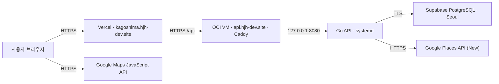

# 배포 아키텍처

## 운영 구성

프런트엔드만 Supabase에 직접 연결하는 경로는 없습니다. 모든 사용자·여행·체크리스트 데이터는 Go API의 인증·소유권 검사를 통과한 뒤 PostgreSQL에 접근합니다.

## 프런트엔드: Vercel

- 기준 브랜치: `main`
- 프로젝트: `apps/web`
- 빌드: `npm run build`
- 산출물: `apps/web/dist`
- SPA 경로와 `/api` 프록시: `vercel.json`

필수 Production 환경변수:

| 이름 | 역할 | 보호 방식 |
| --- | --- | --- |
| `VITE_API_BASE_URL` | Go API 기준 URL | 운영 도메인만 사용 |
| `VITE_GOOGLE_MAPS_BROWSER_KEY` | 앱 내부 지도 렌더링 | 웹사이트·Maps JavaScript API 제한 |
| `VITE_GOOGLE_MAPS_MAP_ID` | Advanced Marker용 Map ID | 비밀 값은 아니며 환경별 분리 |

브라우저 지도 키는 번들에서 확인될 수 있으므로 숨김이 아니라 HTTP referrer, 허용 API와 일별·월별 할당량 제한으로 보호합니다. Places 검색용 서버 키와 브라우저 키는 분리합니다.

## API: Oracle Cloud VM

- 아키텍처: ARM64
- 외부 연결: Caddy 443 → `127.0.0.1:8080`
- 실행: `/home/opc/travel-api/travel-api`
- 환경 파일: `/home/opc/travel-api/.env` (`0600`)
- 서비스: `/etc/systemd/system/travel-api.service`
- 상태 확인: `GET /healthz`

API 변경이 main에 병합되면 `.github/workflows/api-release-build.yml`이 ARM64 바이너리를 빌드하고 VM에 `travel-api.next`로 전송합니다. 서버 배포 스크립트는 production 환경을 검증하고 이전 바이너리를 백업한 뒤 재시작·상태 검사를 수행합니다. 상태 검사가 실패하면 이전 바이너리로 복구합니다.

운영 환경변수와 GitHub Secrets의 실제 값은 저장소에 기록하지 않습니다. 이름과 등록 위치는 [`ORACLE_VM_DEPLOYMENT_RUNBOOK.md`](./ORACLE_VM_DEPLOYMENT_RUNBOOK.md)를 기준으로 합니다.

## 데이터베이스: Supabase PostgreSQL

- 운영 데이터는 VM 로컬 디스크가 아니라 Supabase PostgreSQL에 저장합니다.
- 초기 스키마: `apps/api/schema.sql`
- 증분 마이그레이션: `apps/api/internal/db/migrations/*.sql`
- API 시작 시 증분 마이그레이션을 파일명 순서로 반복 적용합니다.
- `DATABASE_URL`은 TLS가 적용된 운영 연결 문자열을 사용합니다.

VM을 다시 만들더라도 Supabase 데이터는 유지되지만, 별도 백업과 복구 검증은 계속 필요합니다. 스키마 변경 PR은 기존 데이터 호환성과 롤백 방법을 함께 설명합니다.

## 배포 후 확인

1. `https://api.hjh-dev.site/healthz`가 성공하는지 확인합니다.
2. 시작 화면과 로그인 세션 복구가 정상인지 확인합니다.
3. 여행 목록·공유 링크·장소 검색 중 변경과 관련된 대표 흐름을 확인합니다.
4. Vercel과 API 로그에 새 오류가 없는지 확인합니다.
5. PWA가 입력 중인 폼을 잃지 않고 새 버전을 적용하는지 확인합니다.

GitHub Actions 실행을 기다리지 않는 작업 방식이라도 실패 알림이 오면 해당 커밋의 배포 로그와 VM의 `journalctl -u travel-api`를 기준으로 진단합니다.
