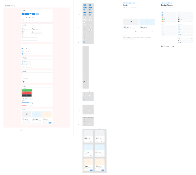

# Figma Component Audit

Source file:
`/Users/hanjeonghyun/Downloads/[NOWB] UI 디자이너 필수 컴포넌트 75개 + 예제 부록(1).fig`

Extracted preview:

## 확인 결과

- `.fig` 파일은 zip 컨테이너이며 내부에 `canvas.fig`, `thumbnail.png`, `meta.json`가 포함되어 있다.
- `thumbnail.png`는 400 x 356 미리보기 이미지로 확인 가능하다.
- `canvas.fig`는 Figma 전용 바이너리 데이터라 로컬 텍스트 파서로 레이어, 컴포넌트 이름, 색상 토큰을 직접 추출하기 어렵다.
- 정확한 컴포넌트 단위 분석은 Figma 앱에서 파일을 열고 주요 프레임을 PNG/PDF로 export하거나, Figma API 접근 가능한 파일 링크와 토큰이 필요하다.

## 썸네일 기준 디자인 시스템 성격

이 파일은 단일 앱 시안이라기보다 UI 디자이너용 기본 컴포넌트 라이브러리에 가깝다.

- 폼 필드, 체크박스, 라디오, 토글 등 입력 컴포넌트
- 주요 버튼, 보조 버튼, 상태 버튼
- 카드와 리스트 아이템
- 태그, 배지, 상태 라벨
- 테이블 또는 데이터 표시 컴포넌트
- 모바일 카드/리스트 예제
- 단순한 회색/블루 기반의 실무형 UI 톤

## 현재 가고시마 앱에 바로 가져올 만한 패턴

### 1. 버튼

현재 앱 적용 상태:

- `primary-button`: 지도 열기, 전화하기 같은 핵심 행동
- `secondary-button`: 지도 보기, 주소 복사 같은 보조 행동
- `quick-button`: 홈의 빠른 이동 버튼

추가 적용 방향:

- 핵심 행동은 한 화면에 1개만 가장 진하게 유지한다.
- 보조 버튼은 연한 배경 + 진한 텍스트로 유지한다.
- 긴급 버튼은 빨간색을 과하게 쓰지 않고 톤다운된 danger 색상만 사용한다.
- 모든 버튼은 최소 높이 48px 이상을 유지한다.

### 2. 카드

현재 앱 적용 상태:

- 다음 일정 카드
- 일정 카드
- 장소 카드
- 긴급 연락 카드
- 체크리스트 행

추가 적용 방향:

- 카드 내부 여백은 20-24px로 유지한다.
- 카드 안에 제목, 설명, 행동 버튼의 순서를 일관되게 둔다.
- 여행 중 바로 눌러야 하는 카드에는 버튼을 카드 하단 전체 폭으로 둔다.
- 정보성 카드에는 버튼을 작게 두고 텍스트 가독성을 우선한다.

### 3. 탭

현재 앱 적용 상태:

- 하단 탭을 `오늘 / 전체 일정 / 지도 / 긴급` 4개로 축소했다.
- 활성 탭은 골드 라인과 진한 그린 텍스트로 표시한다.

추가 적용 방향:

- 부모님 사용성을 위해 탭은 4개 이하로 유지한다.
- 탭 라벨은 2-4글자 또는 의미가 확실한 짧은 구로 유지한다.
- `체크리스트`처럼 보조적인 화면은 독립 탭보다 관련 화면 안에 포함한다.

### 4. 리스트

현재 앱 적용 상태:

- 추천 루트 리스트
- 체크리스트 리스트
- 장소 리스트

추가 적용 방향:

- 리스트는 아이콘 + 제목 + 설명 구조를 유지한다.
- 긴 설명보다 부모님이 바로 이해할 수 있는 한 문장을 우선한다.
- 체크리스트는 터치 가능한 행 전체를 버튼으로 유지한다.

### 5. 배지와 상태 라벨

현재 앱 적용 상태:

- `다음 일정`
- 일정 타입 라벨: 이동, 식사, 관광 등

추가 적용 방향:

- 일정 타입 배지는 작고 차분하게 둔다.
- 긴급, 주의, 예약 확인 같은 상태는 배지 색상을 분리해도 좋다.
- 하지만 색상 수는 그린, 골드, danger 3계열 안에서 유지한다.

## 현재 UI와의 차이

Figma 썸네일의 컴포넌트는 범용 SaaS/관리 도구에 가까운 밀도와 중립 색상을 갖고 있다. 반면 가고시마 앱은 부모님용 여행 도우미이므로 그대로 복제하지 않고 아래 원칙만 가져가는 것이 적합하다.

- 버튼/카드/리스트의 구조적 일관성
- 명확한 상태 표시
- 충분한 터치 영역
- 과하지 않은 색상 대비
- 화면당 핵심 행동 1-2개

## 보류할 요소

- 복잡한 테이블 컴포넌트: 여행 중 부모님이 볼 화면에는 부적합하다.
- 촘촘한 폼 컴포넌트: 1차 MVP에서는 입력보다 조회가 핵심이다.
- 다중 필터/검색 UI: 실제 일정 데이터가 많아진 뒤 검토한다.
- 지나치게 작은 배지/컨트롤: 모바일 현장 사용성에 불리하다.

## 다음 적용 후보

1. 실제 여행 데이터 입력 후 일정 카드 구조 개선
   - `시간`
   - `장소`
   - `이동 버튼`
   - `부모님 메모`

2. 숙소 정보 카드 강화
   - 주소 복사
   - 지도 열기
   - 전화하기
   - 일본어 문장

3. 골프장 카드 추가
   - 티오프 시간
   - 이동 시간
   - 클럽하우스 연락처
   - 복장/준비물 메모

4. 체크리스트 상태 개선
   - 완료 개수 표시
   - 필수 항목 우선 노출
   - 여행 전/당일/귀국 전 그룹화

## 결론

이 Figma 파일은 현재 앱에 직접 이식할 완성 시안이라기보다, 버튼/카드/리스트/탭의 기본 질서를 참고하는 컴포넌트 레퍼런스로 쓰는 것이 가장 적합하다. 현재 앱은 이미 4탭 구조와 컨시어지 톤으로 정리되었으므로, 다음 디자인 개선은 실제 여행 데이터가 들어온 뒤 카드 정보 위계를 다듬는 방식이 좋다.
