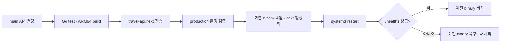

# Oracle VM API 자동 배포·복구 런북

현재 production API는 GitHub Actions가 OCI VM의 `/home/opc/travel-api`에 ARM64 바이너리를 배포합니다. `infra/oracle`의 `/opt/travel-api` 구성은 새 VM을 수동으로 초기화하거나 복구할 때 사용할 수 있는 별도 도구입니다.

## 1. 현재 자동 배포 경로



관련 파일:

- 워크플로: `.github/workflows/api-release-build.yml`
- VM 배포 로직: `scripts/deploy-api-on-vm.sh`
- production 서비스: `scripts/travel-api.service`
- 배포 회귀 테스트: `scripts/deploy-api-on-vm.test.sh`

## 2. GitHub Secrets

| 이름 | 역할 |
| --- | --- |
| `OCI_VM_IP` | VM 공인 IP 또는 호스트 |
| `OCI_VM_USER` | SSH 사용자, 현재 `opc` |
| `OCI_SSH_KEY` | 배포용 SSH 개인키 |
| `GOOGLE_MAPS_API_KEY` | 서버 Places 검색 키 |

키 값은 워크플로 YAML, 문서, 로그에 직접 쓰지 않습니다. SSH 공개키는 VM의 배포 사용자에게만 등록하고 개인키는 GitHub Actions Secret으로 관리합니다.

## 3. VM 디렉터리

```text
/home/opc/travel-api/
  .env
  travel-api
  travel-api.next
  travel-api.service
  deploy-api-on-vm.sh
```

- `.env`: `0600`
- 실행 바이너리와 배포 스크립트: `0750`
- systemd unit: `/etc/systemd/system/travel-api.service`

배포 중에만 `travel-api.rollback-<UTC timestamp>`와 실패 바이너리가 생길 수 있습니다. 정상 배포 뒤 롤백 바이너리는 제거됩니다.

## 4. production 환경변수

`/home/opc/travel-api/.env`에 아래 이름을 설정합니다.

```env
APP_ENV=production
PORT=8080
DATABASE_URL=<Supabase PostgreSQL TLS URL>
JWT_SECRET=<32자 이상의 무작위 값>
ALLOWED_ORIGINS=https://kagoshima.hjh-dev.site
GOOGLE_MAPS_API_KEY=<Places API 서버 키>
```

메일 발송을 사용하는 production에서는 저장소의 `apps/api/.env.example`에 선언된 SMTP 환경변수도 설정합니다.

금지 사항:

- `AUTH_TEST_BYPASS`를 production에 설정하지 않습니다.
- `JWT_SECRET`에 `replace`, `change-me` 같은 placeholder를 사용하지 않습니다.
- `ALLOWED_ORIGINS`에 HTTP, 경로, 쿼리 또는 와일드카드를 넣지 않습니다.

환경 파일을 직접 보정할 때 같은 키가 중복되지 않게 기존 줄을 먼저 제거합니다.

```bash
sed -i '/^APP_ENV=/d' /home/opc/travel-api/.env
printf 'APP_ENV=production\n' >> /home/opc/travel-api/.env
chmod 600 /home/opc/travel-api/.env
```

## 5. 수동 상태 확인

```bash
sudo systemctl status travel-api --no-pager
curl --fail --silent http://127.0.0.1:8080/healthz
curl --fail --silent https://api.hjh-dev.site/healthz
sudo journalctl -u travel-api -n 100 --no-pager
```

환경 파일 값 자체를 출력하는 명령은 화면 공유나 CI 로그에서 실행하지 않습니다.

## 6. 실패 원인별 대응

### production 환경 검증 실패

`scripts/deploy-api-on-vm.sh`가 새 바이너리를 바꾸기 전에 중단합니다. `.env`의 필수 키, JWT 길이, `AUTH_TEST_BYPASS`, Origin 형식을 확인한 뒤 workflow를 다시 실행합니다.

### `Text file busy`

실행 중인 바이너리에 덮어쓰지 않습니다. 워크플로는 항상 `travel-api.next`로 전송하고, 기존 활성 바이너리를 timestamp가 붙은 롤백 파일로 `mv`한 뒤 next를 활성화합니다. 예전 방식의 `travel-api.old`가 남아 있으면 첫 롤백 후보로 흡수합니다.

### systemd 시작 실패

```bash
sudo systemctl daemon-reload
sudo systemctl restart travel-api
sudo journalctl -u travel-api -n 150 --no-pager
```

서비스 unit의 `WorkingDirectory`, `ExecStart`, `EnvironmentFile`이 모두 `/home/opc/travel-api`를 가리키는지 확인합니다.

### health check 실패

배포 스크립트가 이전 바이너리를 복구합니다. 복구도 실패했다면 다음 순서로 확인합니다.

1. `systemctl status`와 `journalctl`
2. `.env` 권한과 필수 환경변수 이름
3. Supabase 연결과 TLS
4. 8080 포트 점유
5. Caddy upstream과 인증서

실패한 새 바이너리는 `travel-api.failed-<timestamp>`로 남을 수 있으므로 원인 분석 뒤 명시적인 파일만 제거합니다.

## 7. 수동 재배포

GitHub Actions를 사용할 수 없을 때 로컬에서 ARM64 바이너리를 빌드해 `travel-api.next`로 전송한 후 동일 스크립트를 실행합니다.

```bash
cd apps/api
CGO_ENABLED=0 GOOS=linux GOARCH=arm64 go build -trimpath -ldflags="-s -w" -o /tmp/travel-api.next ./cmd/api
scp -i <SSH_KEY> /tmp/travel-api.next opc@<OCI_VM_IP>:/home/opc/travel-api/travel-api.next
ssh -i <SSH_KEY> opc@<OCI_VM_IP> '/home/opc/travel-api/deploy-api-on-vm.sh /home/opc/travel-api'
```

실제 키 경로나 IP를 문서 또는 셸 기록에 고정하지 않습니다.

## 8. 새 VM 복구

새 VM을 처음 구성할 때는 [`../infra/oracle/README.md`](../infra/oracle/README.md)의 수동 초기화 도구를 사용할 수 있습니다. 다만 자동 배포 표준 경로와 실행 사용자가 다르므로, production 복구에서는 다음 중 하나를 선택해 끝까지 통일합니다.

- 현재 표준: `opc`, `/home/opc/travel-api`, `scripts/travel-api.service`
- 수동 강화 구성: `travel-api` 시스템 사용자, `/opt/travel-api`, `infra/oracle/systemd/travel-api.service`

두 unit과 두 배포 스크립트를 한 서비스에 섞지 않습니다.

## 9. 배포 전후 체크리스트

### 배포 전

- API 테스트와 `scripts/deploy-api-on-vm.test.sh` 통과
- 스키마 변경의 기존 데이터 호환성 확인
- GitHub Secrets 이름과 VM SSH 접근 확인
- `.env`의 production 가드 확인

### 배포 후

- 내부·외부 `/healthz` 확인
- 로그인 세션 복구 확인
- 변경된 대표 API 흐름 확인
- 새 migration 적용 오류가 없는지 로그 확인
- 롤백 임시 파일이 정상 정리됐는지 확인
