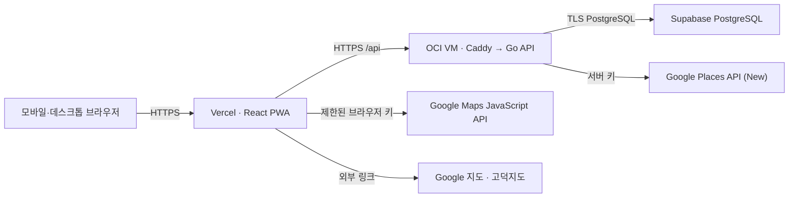
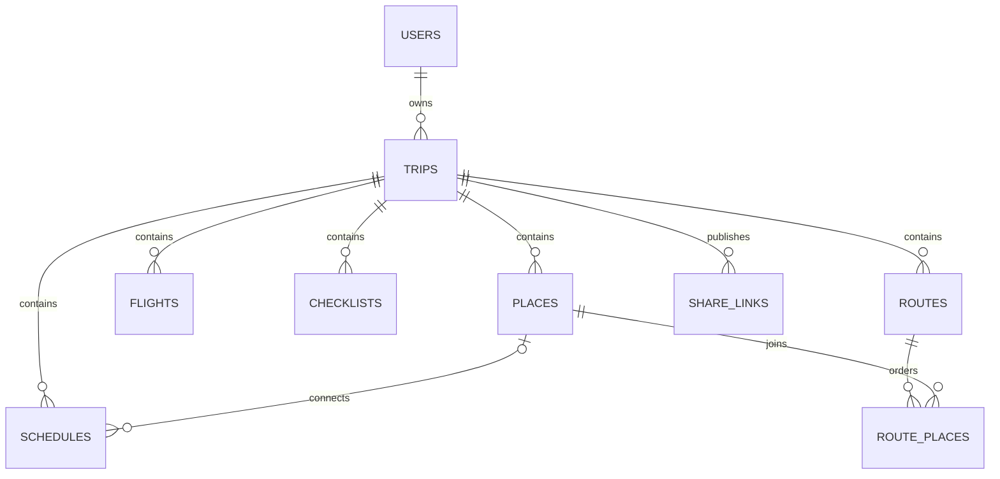

# 기술 설계서

이 문서는 현재 운영 중인 Map Planner의 웹·API·데이터 경계와 변경 시 지켜야 할 계약을 설명합니다. 세부 API 목록의 실행 기준은 `apps/api/internal/handler/openapi.json`입니다.

## 1. 시스템 구성



- 브라우저는 PostgreSQL에 직접 연결하지 않습니다.
- 장소 검색은 비용·키 보호를 위해 인증된 Go API가 Google Places를 호출합니다.
- 앱 내부 지도 렌더링에는 웹사이트와 API가 제한된 브라우저 키를 사용합니다.
- 실제 길찾기는 Google 지도 또는 목적지에 맞는 외부 지도 서비스로 넘깁니다.

## 2. 프런트엔드

### 기술과 진입점

- React `19.2.8`, React DOM `19.2.8`, TypeScript, Vite
- `vite-plugin-pwa` 기반 서비스 워커와 설치 가능한 PWA
- Pretendard Variable 자체 호스팅, Vanilla CSS 토큰
- 앱 진입점: `apps/web/src/main.tsx`, 경로 분기: `apps/web/src/App.tsx`

### 주요 경로

| 경로 | 역할 |
| --- | --- |
| `/` | 비로그인 시작 화면 |
| `/demo` | 상하이 샘플 여행 |
| `/manage` | 로그인·여행 목록·여행 생성 |
| `/manage/account` | 계정과 비밀번호 관리 |
| `/manage/trips/:id` | 소유자 여행 보기 |
| `/manage/trips/:id/edit` | 여행 편집 허브 |
| `/manage/trips/:id/edit/:section` | 기본정보·장소·일정·항공·체크리스트 편집 |
| `/share/:token` | 로그인 없는 읽기 전용 공유 여행 |

여행 보기의 오늘·일정·지도·항공·긴급·마이페이지 상태는 URL 해시와 동기화합니다. 예를 들어 `#map`, `#schedule`, `#schedule-checklist`로 직접 진입하거나 새로고침해도 같은 보기를 유지합니다.

### 화면 상태 경계

- 서버 데이터: 여행, 장소, 일정, 항공편, 공유 링크, 체크리스트
- 기기 상태: 데모 완료 상태, 일부 오프라인 복원 데이터, PWA 업데이트 상태
- 브라우저 메모리: 사용자가 허용한 현재 위치
- URL: 관리 대상 여행·편집 섹션·여행 보기 탭

현재 위치는 API, DB, 로그 또는 공유 응답에 저장하지 않습니다.

## 3. Go API

Go 표준 `net/http` ServeMux와 pgx 기반 저장소를 사용합니다. `DATABASE_URL`이 없으면 개발·테스트용 인메모리 저장소를 사용하지만, production에서는 PostgreSQL 연결이 필수입니다.

### 공개 엔드포인트

- 상태·문서: `GET /healthz`, `GET /docs`, `GET /openapi.json`
- 인증 시작: 회원가입, 로그인, 로그아웃, 인증코드, 비밀번호 복구
- 공유 조회: `GET /api/share/{token}`

### 인증 엔드포인트

- 세션·계정: 내 정보, 비밀번호 변경, 계정 삭제
- 여행 CRUD와 공유 링크 생성
- 여행별 일정·장소·항공편·루트 조회 및 변경
- 여행별 체크리스트 조회·추가·완료·삭제
- 여행 범위 안에서 Google Places 검색

모든 여행 변경은 JWT의 사용자와 여행의 `owner_id`가 일치하는지 확인해야 합니다.

## 4. 인증과 세션

- 비밀번호는 bcrypt 해시만 저장합니다.
- 브라우저 세션은 `map_planner_session` HttpOnly 쿠키를 우선 사용합니다.
- API 클라이언트 호환성을 위해 Bearer 토큰도 받을 수 있습니다.
- 비밀번호 변경·복구·계정 상태 변경 시 `token_version`으로 이전 세션을 무효화합니다.
- 회원가입과 비밀번호 복구 인증코드는 원문 대신 해시·만료·시도 횟수·일별 요청 횟수를 저장합니다.
- production에서 `JWT_SECRET`은 32자 이상이며 placeholder일 수 없고 `AUTH_TEST_BYPASS`는 금지됩니다.

브라우저의 POST·PATCH·DELETE 요청은 허용된 HTTPS Origin 또는 같은 호스트인지 검증합니다. 쿠키가 있는 Origin 없는 변경 요청은 Bearer 인증이 없으면 거절합니다.

## 5. 공개 공유 경계

공유 링크는 로그인 없는 읽기 전용 초대장입니다. `SharedTripResponse`는 소유자 응답을 그대로 재사용하지 않고 `PublicTripResponse`를 사용합니다.

공개 여행 기본 정보에 포함되는 값:

- 제목, 시작일, 종료일, 동행자, 목적지 국가

공개 기본 정보에서 제외되는 값:

- 소유자 ID
- 여행 내부 메모
- 인증·계정 정보

새 필드를 소유자 DTO에 추가할 때는 공개 DTO에 자동 포함하지 않습니다. 공유 테스트에서 내부 메모와 예약성 정보가 노출되지 않는지 먼저 확인합니다.

## 6. 데이터 모델



핵심 불변조건:

- 모든 여행 하위 데이터는 `trip_id`로 소유권을 추적합니다.
- 여행 종료일은 시작일보다 빠를 수 없습니다.
- 일정 날짜와 날짜 지정 체크리스트는 여행 기간 안에 있어야 합니다.
- 여행 기간 변경으로 기존 일정이나 체크리스트가 범위 밖이 되면 DB 트리거가 변경을 거절합니다.
- 장소 좌표는 검색 결과가 제공하며 사용자가 위도·경도를 직접 입력하는 흐름을 기본으로 하지 않습니다.
- 월별 외부 API 사용량은 `external_api_monthly_usage`로 집계합니다.

초기 스키마는 `apps/api/schema.sql`, 기존 운영 DB의 반복 가능한 증분 변경은 `apps/api/internal/db/migrations/*.sql`이 담당합니다. API 시작 시 파일명 순서로 마이그레이션을 적용합니다.

## 7. 장소와 지도

1. 사용자가 여행의 장소 관리 화면에서 이름이나 키워드를 검색합니다.
2. API가 목적지 국가와 언어를 고려해 Places API (New)를 호출합니다.
3. 사용자가 결과를 선택하면 이름·주소·좌표·Google Place ID를 기존 장소 생성 흐름으로 저장합니다.
4. 일정은 저장 장소를 선택해 연결합니다.
5. 지도 탭은 일정에 연결된 장소와 저장 장소를 핀으로 표시합니다.
6. 길찾기는 Google 지도와, 중국 목적지에서는 고덕지도 중 선택합니다.

Google API가 실패하거나 지도 스크립트를 불러오지 못해도 장소 목록·주소·외부 길찾기는 계속 사용할 수 있어야 합니다.

## 8. 오프라인과 PWA 업데이트

- 정적 앱 셸과 번들·폰트는 서비스 워커가 캐시합니다.
- 최근 확인한 여행 데이터는 네트워크 단절 시 복구 가능한 범위에서 표시합니다.
- 일시적인 LTE·5G·Wi-Fi 전환을 영구 오프라인으로 단정하지 않습니다.
- 새 서비스 워커는 입력 중인 폼을 보호하면서 안전한 시점에 적용합니다.
- 데이터 변경은 오프라인에서 성공한 것처럼 표시하지 않고 재시도 가능한 안내를 제공합니다.

## 9. 검증 기준

```bash
npm run check
cd apps/api && go test -race ./... -count=1
cd apps/api && go vet ./...
cd apps/api && test -z "$(gofmt -l .)"
```

보안 관련 변경은 CodeQL·시크릿 검사·의존성 취약점 검사와 공개 공유 경계 테스트를 함께 통과해야 합니다.
