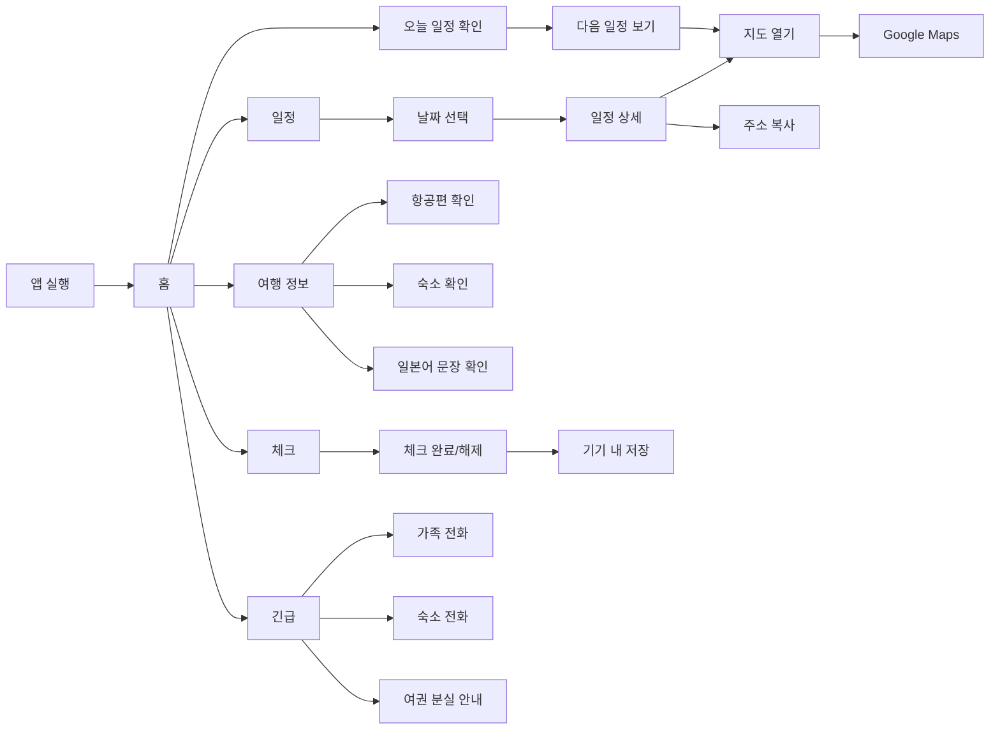
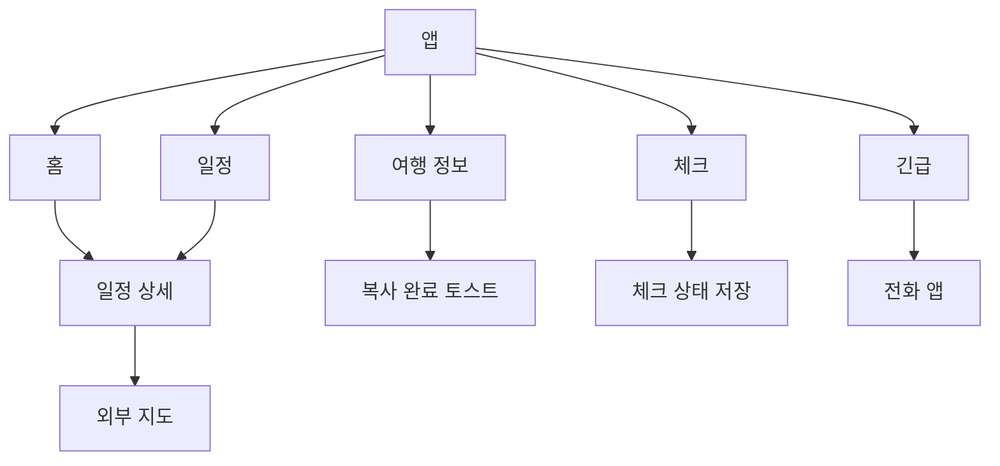

# 유저 플로우 (User Flow)

유저 플로우는 부모님이 앱을 열고 필요한 정보를 찾는 이동 흐름을 정리한 문서입니다.

## 1. 전체 흐름

## 2. 주요 시나리오

### 시나리오 A. 오늘 다음 일정 확인

1. 부모님이 앱을 실행한다.
2. 홈 화면에서 오늘 날짜와 여행 일차를 본다.
3. 다음 일정 카드에서 시간과 장소를 확인한다.
4. 지도 열기 버튼을 누른다.
5. Google Maps에서 길찾기를 진행한다.

성공 조건:
- 앱 실행 후 다음 일정까지 한 화면에서 확인 가능하다.
- 지도 버튼이 명확히 보인다.

### 시나리오 B. 날짜별 전체 일정 확인

1. 하단 탭에서 일정을 누른다.
2. 확인할 날짜를 선택한다.
3. 시간순 일정 목록을 본다.
4. 특정 일정을 누른다.
5. 이동 방법, 주소, 예약 메모를 확인한다.

성공 조건:
- 날짜별 일정이 섞이지 않는다.
- 일정 상세에서 부모님께 필요한 메모가 먼저 보인다.

### 시나리오 C. 숙소 주소 보여주기

1. 하단 탭에서 여행 정보를 누른다.
2. 숙소 섹션을 연다.
3. 숙소 이름, 주소, 전화번호를 확인한다.
4. 필요하면 주소 복사 버튼을 누른다.

성공 조건:
- 숙소 주소를 일본 현지 직원에게 바로 보여줄 수 있다.
- 전화번호는 탭해서 전화할 수 있다.

### 시나리오 D. 긴급 상황 대응

1. 하단 탭에서 긴급을 누른다.
2. 상황별 안내 중 필요한 항목을 선택한다.
3. 가족, 숙소, 보험사, 영사관 연락처를 확인한다.
4. 전화 버튼을 누른다.

성공 조건:
- 긴급 화면은 모든 화면에서 하단 탭으로 접근 가능하다.
- 연락처와 행동 순서가 한 화면에서 이해된다.

## 3. 화면 전환 구조

## 4. 예외 흐름

| 상황 | 처리 |
| --- | --- |
| 오늘 일정이 없음 | 다음 일정 또는 여행 정보 확인 버튼 표시 |
| 지도 링크가 없음 | 주소 기반 Google Maps 검색 링크 생성 |
| 오프라인 상태 | 일정, 체크리스트, 긴급 정보는 계속 표시 |
| 전화번호가 없음 | 전화 버튼 숨김, 텍스트 정보만 표시 |
| 체크리스트 저장 실패 | 화면 상태는 유지하고 재시도 안내 |

