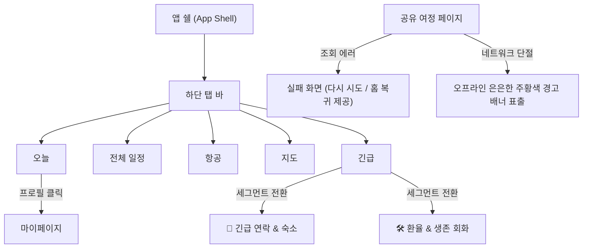

# 유저 플로우 (User Flow)

유저 플로우는 사용자가 앱을 열고 필요한 정보에 접근하고 조작하는 실제 동선과 흐름을 정리한 설계 가이드 문서입니다.

## 1. 전체 흐름

```mermaid
flowchart TD
  Start["앱 실행"] --> Home["홈 (오늘 탭)"]
  
  subgraph 하단 탭 바 (5개 메뉴, 12px 가독성 확보)
    Tab1["오늘 (today)"]
    Tab2["전체 일정 (schedule)"]
    Tab3["항공편 (flight)"]
    Tab4["지도 (map)"]
    Tab5["긴급 정보 (concierge)"]
  end

  Home --> Tab1
  Home --> Tab2
  Home --> Tab3
  Home --> Tab4
  Home --> Tab5

  %% 1. 오늘 탭 상세 흐름
  Tab1 --> Checklist["체크리스트 & 일정 프로그레스 바"]
  Checklist --> Toggle["체크박스 완료/해제 토글"]
  Tab1 --> NextAction["오늘 다음 일정 카드"]
  NextAction --> MapDirection["Google Maps 길찾기 연동"]
  Tab1 --> ProfileButton["상단 프로필 버튼 (User 아이콘)"]
  ProfileButton --> MyPage["마이페이지 (mypage)"]
  MyPage --> ChangePassword["비밀번호 변경 (접근성 포커스 지원)"]
  MyPage --> Logout["로그아웃 & 대시보드 복귀"]

  %% 2. 전체 일정 흐름
  Tab2 --> DateList["날짜별 일정 그룹"]
  DateList --> MoveSchedule["일정 순서 조정 (상하 이동)"]

  %% 3. 항공편 흐름
  Tab3 --> FlightDetails["항공편 정보 확인"]
  FlightDetails --> MaskToggle["편명/예약번호 보기 토글 (MaskedText)"]

  %% 4. 지도 흐름
  Tab4 --> PlaceList["여행 장소 리스트"]
  PlaceList --> MapLocation["구글 지도 위치 확인"]

  %% 5. 긴급 정보 흐름
  Tab5 --> SegmentControl["2단 세그먼트 메뉴 스위치"]
  SegmentControl -->|기본 선택| EmergencyContacts["🚨 긴급 연락 & 숙소"]
  SegmentControl -->|도구 선택| ConvenienceTools["🛠️ 환율 & 생존 회화"]
  EmergencyContacts --> CallFamily["가족 전화 (번호 미등록 시 숨김)"]
  EmergencyContacts --> CallHotel["숙소 전화 (등록 시 자동 바인딩)"]
  ConvenienceTools --> CalcExchange["다국어 환율 변환 위젯"]
  ConvenienceTools --> TranslatePhrase["생존 회화 리스트 (줌인 확대 지원)"]
```

## 2. 주요 시나리오

### 시나리오 A. 오늘 일정 확인 및 체크리스트 조작

1. 사용자가 앱을 실행하면 즉시 **오늘 탭**이 표시된다.
2. 상단 D-Day 뱃지와 국가 코드 뱃지, 실시간 여행 단계별 가이드를 확인한다.
3. 오늘 해야 할 핵심 **체크리스트 목록**을 보며 물품 준비 완료 여부를 토글한다.
4. 체크 박스를 토글할 때마다 상단의 **통합 달성도 프로그레스 바**가 실시간으로 채워진다.
5. 오늘 가야 할 **다음 일정 카드**를 보고 지도 열기를 누르면 Google Maps로 길을 찾는다.

성공 조건:
- 앱 진입과 동시에 오늘 일정 확인과 체크리스트 관리가 원스크롤 상에서 조작 가능하다.
- 체크 상태가 변경될 때마다 그라디언트 프로그레스 게이지가 역동적으로 갱신된다.

### 시나리오 B. 날짜별 스케줄 순서 조율

1. 하단 탭 바에서 **전체 일정**을 선택한다.
2. 일자별 타임라인 스케줄 목록을 스캔한다.
3. 특정 일정 카드의 화살표 버튼(▲ / ▼)을 눌러 순서를 동적으로 교환한다.
4. 조정한 순서는 즉시 내부 상태와 기기 로컬 저장소에 반영된다.

성공 조건:
- 사용자가 복잡한 편집 폼 없이 화살표 터치만으로 일정 순서를 자유롭게 스왑할 수 있다.

### 시나리오 C. 여행 도구 활용 및 긴급 대응

1. 하단 탭 바에서 **긴급**을 누른다.
2. 탭 진입 시 기본 활성화된 **🚨 긴급 연락 & 숙소**에서 등록된 숙소 주소와 안전 연락처를 확인한다.
3. 숙소 연락처나 가족 연락처가 없을 경우 '연락처 미등록' 상태 배지가 보이며 위험한 유령 전화를 막아준다.
4. 상단 우측의 **🛠️ 환율 & 생존 회화** 세그먼트 단추를 터치한다.
5. 환율 계산 폼에서 엔/위안화를 입력하면 원화 금액이 자동 환산되며, 생존 회화 목록 중 하나를 터치해 줌인(Zoom-in) 확대하여 현지인에게 화면을 제시한다.

성공 조건:
- 위급 상황 시에는 번잡한 스크롤 없이 가족/숙소 번호가 전면에 보이고, 일상적인 계산/번역 조작은 도구 탭으로 완전 격리되어 시인성을 만족한다.

---

## 3. 화면 전환 구조



## 4. 예외 흐름

| 상황 | 처리 |
| --- | --- |
| 오늘 일정이 없음 | 다음 일정 없음 안내 메시지 및 전체 일정 링크 배치 |
| 지도 정보가 없음 | 주소 또는 장소 이름 기반의 자동 구글 검색 dir 경로 생성 |
| 오프라인 캐시 복구 성공 | SharedTripPage 본문을 그대로 그리며 상단에 "오프라인 데이터를 표시 중" 주황색 Warning 알림 노출 |
| 긴급 탭 연락처 미등록 | 전화 버튼 숨김 처리 및 "연락처 미등록" 상태 배지 렌더링 |
| 비밀번호 눈 아이콘 포커스 | 키보드 Tab키 접근 수용 및 현재 보안 낭독용 aria-label 상태 전달 |
| 데모 모드 마이페이지 진입 | 비밀번호 변경 폼을 원천 격리하고 "로그인하고 내 여행 만들기" 유도 CTA 인트로 카드 표시 |


