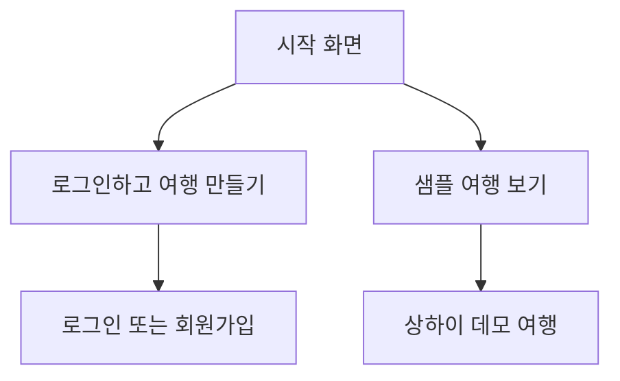
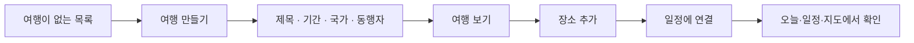
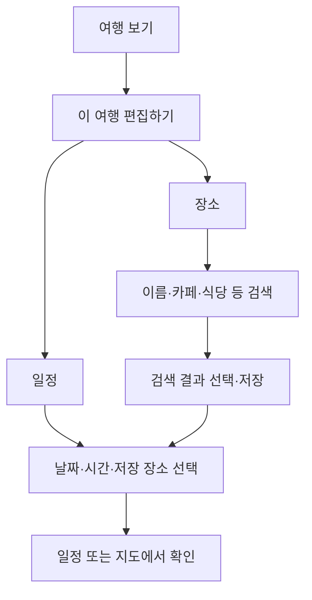
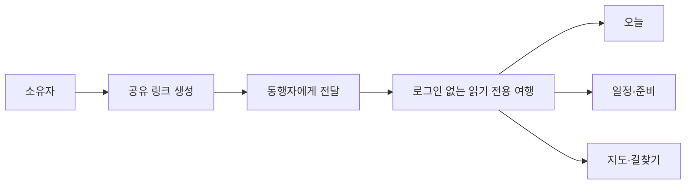

# 사용자 흐름

Map Planner는 여행을 만드는 소유자와 공유 링크를 확인하는 동행자의 흐름을 분리합니다. 두 사용자는 같은 여행 보기 문법을 사용하지만, 변경 권한과 공개 데이터 범위가 다릅니다.

## 1. 비로그인 시작

```mermaid
flowchart TD
  Start["시작 화면"] --> Login["로그인하고 여행 만들기"]
  Start --> Demo["샘플 여행 보기"]
  Login --> Auth["로그인 또는 회원가입"]
  Demo --> DemoTrip["상하이 데모 여행"]
```

시작 화면에는 두 개의 분명한 행동만 둡니다. 실제 데이터를 만들려는 사용자는 `/manage`, 제품을 먼저 살펴보려는 사용자는 `/demo`로 이동합니다.

## 2. 회원가입과 로그인

### 회원가입

1. 이메일을 입력하고 가입용 인증코드를 요청합니다.
2. 받은 6자리 코드를 입력해 검증합니다.
3. 비밀번호 규칙을 충족하는 비밀번호를 입력합니다.
4. 가입이 완료되면 세션을 발급하고 여행 목록으로 이동합니다.

인증코드 오류는 만료, 불일치, 요청 한도처럼 사용자가 다음 행동을 결정할 수 있는 문구로 표시합니다. 중복 제출 중에는 버튼을 비활성화하고 진행 상태를 알립니다.

### 로그인과 세션 복구

1. 이메일과 비밀번호로 로그인합니다.
2. API는 HttpOnly 세션 쿠키를 설정합니다.
3. 새로고침하면 `/api/auth/me`로 세션을 복원합니다.
4. 만료된 세션이면 입력 내용을 잃지 않는 범위에서 다시 로그인을 안내합니다.

## 3. 첫 여행 만들기

```mermaid
flowchart LR
  Empty["여행이 없는 목록"] --> Create["여행 만들기"]
  Create --> Basic["제목 · 기간 · 국가 · 동행자"]
  Basic --> Trip["여행 보기"]
  Trip --> AddPlace["장소 추가"]
  AddPlace --> AddSchedule["일정에 연결"]
  AddSchedule --> Today["오늘·일정·지도에서 확인"]
```

- 날짜는 시작일이 종료일보다 늦을 수 없습니다.
- 목적지 국가는 지도·환율·현지 도구와 시작 체크리스트에 사용합니다.
- 사용자가 좌표를 입력하게 하지 않고 장소 검색 결과가 위치를 제공합니다.
- 여행 생성 뒤 빈 상세 화면에 장소와 일정의 다음 행동을 바로 제공합니다.

## 4. 여행 보기

하단 메뉴는 여행 중 자주 사용하는 다섯 개 화면입니다.

| 탭 | 사용자 질문 | 핵심 콘텐츠 |
| --- | --- | --- |
| 오늘 | 지금 무엇을 해야 하나? | 여행 상태, 다음 일정, 오늘 준비물 |
| 일정 | 날짜별로 무엇을 언제 하나? | 날짜 탐색, 시간순 일정, 여행 준비 체크리스트 |
| 지도 | 장소들이 어디에 있고 어떻게 이동하나? | 지도 핀, 현재 위치, 저장 장소, 동선과 외부 길찾기 |
| 항공 | 언제 어디서 출발하고 도착하나? | 출국·귀국 항공편 |
| 긴급 | 현지에서 바로 필요한 도구는? | 긴급 연락, 숙소, 환율·번역·결제 안내 |

마이페이지는 모든 주요 화면 상단의 프로필 버튼과 로그인 직후 여행 목록에서 접근합니다.

### 탭 간 맥락

- 오늘 또는 지도에서 일정을 열면 현재 보고 있던 날짜를 유지합니다.
- 일정과 지도는 같은 장소·날짜 데이터를 각각 시간과 공간 중심으로 보여 줍니다.
- URL의 `#map`, `#schedule`, `#schedule-checklist` 등으로 현재 보기를 유지합니다.

## 5. 장소와 일정 추가

```mermaid
flowchart TD
  Trip["여행 보기"] --> Edit["이 여행 편집하기"]
  Edit --> Places["장소"]
  Places --> Search["이름·카페·식당 등 검색"]
  Search --> SavePlace["검색 결과 선택·저장"]
  Edit --> Schedules["일정"]
  Schedules --> CreateSchedule["날짜·시간·저장 장소 선택"]
  SavePlace --> CreateSchedule
  CreateSchedule --> View["일정 또는 지도에서 확인"]
```

검색 결과를 저장한 뒤 검색·추가 행동은 즉시 다시 사용할 수 있어야 하며 새로고침을 요구하지 않습니다. 장소가 없는 일정도 만들 수 있지만 지도 핀과 길찾기를 사용하려면 저장 장소를 연결합니다.

## 6. 체크리스트

- 여행 전체 항목: 여권, 결제 수단처럼 여행에서 한 번 준비하는 내용
- 날짜별 항목: 특정 날짜의 날씨, 예약 확인처럼 당일에만 필요한 내용
- 오늘 탭: 현재 단계와 날짜에 맞는 항목만 간단히 표시
- 일정의 여행 준비 보기: 전체 항목과 날짜 필터, 편집 기능 제공

## 7. 공유

```mermaid
flowchart LR
  Owner["소유자"] --> CreateLink["공유 링크 생성"]
  CreateLink --> Send["동행자에게 전달"]
  Send --> Public["로그인 없는 읽기 전용 여행"]
  Public --> Today["오늘"]
  Public --> Schedule["일정·준비"]
  Public --> Map["지도·길찾기"]
```

공유 화면은 소유자 화면과 같은 탐색 구조를 재사용하지만 편집 동작을 제공하지 않습니다. 여행 내부 메모, 소유자 ID, 계정 정보는 공개 응답에 포함하지 않습니다.

## 8. 실패와 복구

| 상황 | 사용자 경험 |
| --- | --- |
| 네트워크 일시 단절 | 마지막 데이터와 복구 중임을 알리고 즉시 모든 화면을 막지 않음 |
| 공유 여행을 오프라인 캐시로 확인 | 연결이 복구되면 새로고침 없이 최신 공유 데이터를 다시 조회 |
| 오프라인에서 변경 시도 | 저장하지 못했음을 명확히 표시하고 온라인 재시도 안내 |
| Google 지도 로딩 실패 | 장소 목록·주소·외부 길찾기 유지 |
| 위치 권한 거부 | 저장 장소 지도는 유지하고 권한을 강요하지 않음 |
| API 인증 만료 | 세션 만료 안내와 로그인 복귀 경로 제공 |
| 데이터 없음 | 무엇을 어디서 추가해야 하는지 단일 행동으로 안내 |
